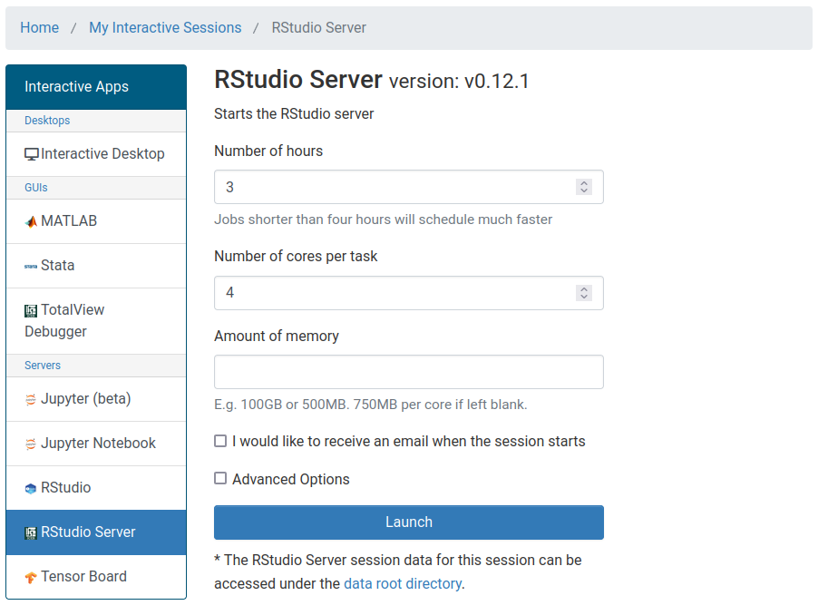

::: challenge

## Get started with RStudio on the HPCC

To use RStudio on the HPCC, we will use OnDemand. Log in here: [https://ondemand.hpcc.msu.edu/pun/sys/dashboard/](https://ondemand.hpcc.msu.edu/pun/sys/dashboard/).

After logging in, from the Interactive Apps pull-down tab, choose RStudio Server.

{alt='OnDemand with interactive apps'}

In the settings for the interactive job, set "Number of hours" to 3 and "Number of cores per task" to 4. Leave the remaining entries blank and click the Launch button.

{alt='OnDemand with job submission options set as described above'}

You will be taken to a list of your interactive jobs. After queuing, your job will start running, and you can access RStudio by clicking the "Connect to RStudio Server" button.

{alt='A card showing a running RStudio job with a button to connect to the server.'}

:::

If you would like to install R and RStudio on your computer in the future, check out the following links:

- [Download and install the latest version of R](https://www.r-project.org/).
- [Download and install RStudio](https://www.rstudio.com/products/rstudio/download/#download).

